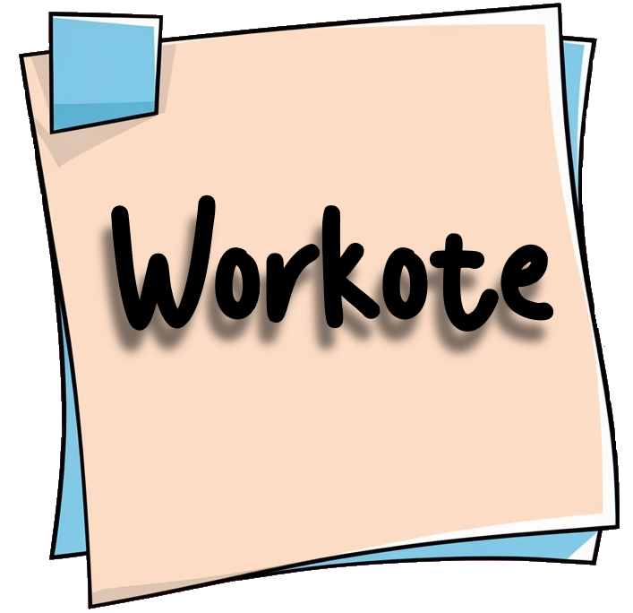
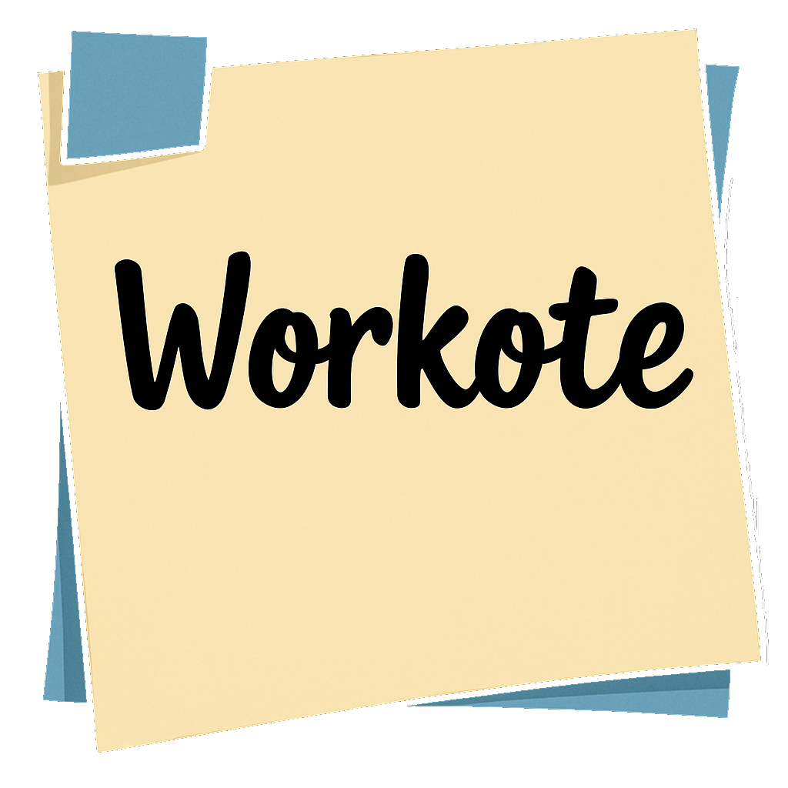
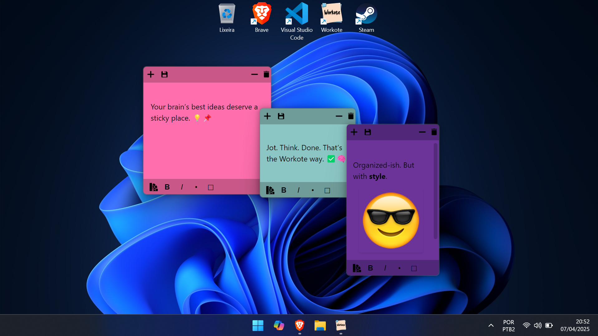

# Pyst-it  (Beta 0.9.1)
A simple sticky notes app.

  

---

🖥️ **Easy-to-use Interface**: Simple and intuitive interface with all essential features right at your fingertips. 

  

---

✨ **Multiple Notes**: Open as many sticky notes as you want on your desktop, each in a different color. 

  

---

🌈 **Random Colors**: 8 vibrant colors for your notes, or even a rare RGB color for a fun touch. (Can you get it?) 

  

---

💾 **Auto-save**: Your notes are automatically saved, ensuring you never lose your progress. 
📝 **File Support**: Save and load notes in both `.txt` and `.json` formats. 
🔒 **Privacy First**: Notes are stored locally on your computer, and you can choose whether to save them or not. 

---

🔄 Beta 0.9.1: New drawing function added (currently in testing phase).
 🔄 Beta 0.9.2: New notification function added.

Start to use it now! 🚀

  

| **Downloads** | **🪟 For Windows** |
|:-------------:|:---------------:|
|  | [⬇️ Download](https://github.com/Heljarmyrkr/Pyst-it/releases/download/v0.9-beta/Pyst-it.exe) |
|  | [⬇️ Download](https://github.com/Heljarmyrkr/Pyst-it/releases/download/v0.9.1-beta/Pyst-it.exe) |
|  | [⬇️ Download](https://github.com/Heljarmyrkr/Pyst-it/releases/download/v0.9.2-beta/Pyst-it.exe) |

---

Full 1.0 version coming soon! 
**Planned Features for Version 1.0:**

✍️ **Customizable Fonts**: Choose from a variety of stylish fonts to give your notes a personal touch and make them truly yours. 
✏️ **Drawing Mode**: Unlock the ability to draw directly on your sticky notes. 
🔔 **Reminders & Notifications**: Set reminders to never forget your important tasks—get notified to check or save your notes whenever you need a prompt. 
 
**Contact and Contributions**: 
🤝 **Contribute**: Help me improve "Pyst-it"! Fork the repo, make changes, and submit a pull request. 
📧 **Contact:** If you have any questions or feedback, reach out at [kauarodr2005@gmail.com]. 

---

## License

This project is licensed under the **Custom License** - see the [LICENSE.txt](./LICENSE.txt) file for details.

- The Software **may not be sold or redistributed** for commercial purposes or profit.
- The above copyright notice and this permission notice must be included in all copies or substantial portions of the Software.

THE SOFTWARE IS PROVIDED "AS IS", WITHOUT WARRANTY OF ANY KIND, EXPRESS OR IMPLIED, INCLUDING BUT NOT LIMITED TO THE WARRANTIES OF 
MERCHANTABILITY, FITNESS FOR A PARTICULAR PURPOSE AND NONINFRINGEMENT. IN NO EVENT SHALL THE AUTHORS OR COPYRIGHT HOLDERS BE LIABLE 
FOR ANY CLAIM, DAMAGES, OR OTHER LIABILITY, WHETHER IN AN ACTION OF CONTRACT, TORT, OR OTHERWISE, ARISING FROM, OUT OF, OR IN CONNECTION 
WITH THE SOFTWARE OR THE USE OR OTHER DEALINGS IN THE SOFTWARE.

---

## Copyright Notice

**Pyst-it** is a parody and has no affiliation with the **Post-it** brand of **3M**. The name **Post-it** and the product design are registered 
trademarks of **3M Company**. 

This project is a work of fiction, and any resemblance to real products is purely for humorous and entertainment purposes. 
All rights to the name "Post-it" and the design of their products belong to **3M**.

---

    <h2>Made with</h2>
    

