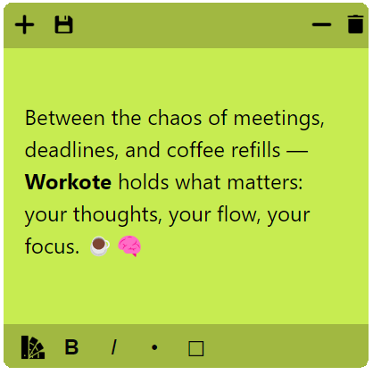
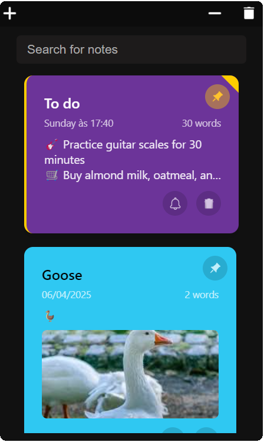
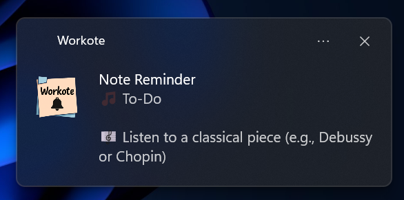

# Workote 
Where work meets notes

  

---

🖥️ **Interface**: Minimalist and simple. 

  

---

✨ **Multiple Notes**: Simple and intuive way to organize your notes 

  

---

💾 Easy Saving: Notes saved can be reopened anytime with just one click. Simple, fast, and reliable.

  

---

📌 Pin Notes: Keep important notes always on top — perfect for reminders while you work.

  

---

🖼️ Image Support: Add images to your notes effortlessly — even by dragging and dropping directly into them. Perfect for visual reminders, moodboards, or quick sketches.

  

---

🔔 **Reminders & Notifications**: Set reminders to never forget your important tasks—get notified to check or save your notes whenever you need a prompt.

  

  

---

🌈 **Colors**: Choose between 8 colors 

  

---

🔄 Version 1.0

Start to use it now! 🚀

| **Downloads** | **🪟 For Windows** |
|:-------------:|:---------------:|
|  | [⬇️ Download](https://github.com/Heljarmyrkr/Pyst-it/releases/download/v0.9-beta/Pyst-it.exe) |

---

🤝 **Contribute**: Want to make Workote even better? Feel free to fork the repository, suggest improvements, or open a pull request. Every contribution is welcome! 
📧 **Contact**: Got questions, ideas, or feedback? Drop me a message at kauarodr2005@gmail.com — I’d love to hear from you. 

---

## License

This project is licensed under the **Custom License** - see the [LICENSE.txt](./LICENSE.txt) file for details.

- The Software **may not be sold or redistributed** for commercial purposes or profit.
- The above copyright notice and this permission notice must be included in all copies or substantial portions of the Software.

THE SOFTWARE IS PROVIDED "AS IS", WITHOUT WARRANTY OF ANY KIND, EXPRESS OR IMPLIED, INCLUDING BUT NOT LIMITED TO THE WARRANTIES OF 
MERCHANTABILITY, FITNESS FOR A PARTICULAR PURPOSE AND NONINFRINGEMENT. IN NO EVENT SHALL THE AUTHORS OR COPYRIGHT HOLDERS BE LIABLE 
FOR ANY CLAIM, DAMAGES, OR OTHER LIABILITY, WHETHER IN AN ACTION OF CONTRACT, TORT, OR OTHERWISE, ARISING FROM, OUT OF, OR IN CONNECTION 
WITH THE SOFTWARE OR THE USE OR OTHER DEALINGS IN THE SOFTWARE.

  <h2>Made with</h2>
  
  
  
  
  
  
  
          
        

